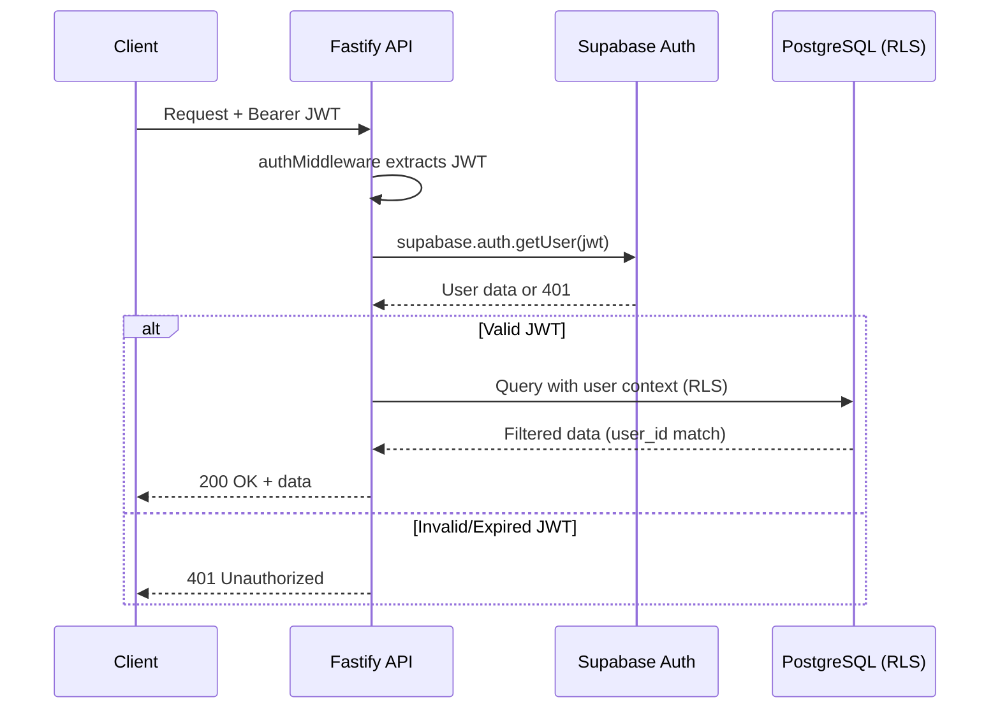

# DecorAI Brasil — Backend Architecture

> **Parent document:** [fullstack-architecture.md](../fullstack-architecture.md) | [Index](./index.md)
> **Section:** 11

---

## 11. Backend Architecture

### 11.1 Service Architecture

```
packages/api/src/
├── server.ts                    # Fastify server setup
├── routes/
│   ├── auth.routes.ts           # POST /auth/*
│   ├── project.routes.ts        # /projects/*
│   ├── chat.routes.ts           # /projects/:id/chat/*
│   ├── render.routes.ts         # /projects/:id/generate, segment, etc.
│   ├── billing.routes.ts        # /subscription/*, /webhooks/*
│   ├── diagnostic.routes.ts     # /diagnostics/*
│   ├── profile.routes.ts        # /profile/*
│   ├── share.routes.ts          # /share/*
│   └── style.routes.ts          # /styles
├── services/
│   ├── auth.service.ts          # Supabase Auth operations
│   ├── project.service.ts       # Project CRUD + versions
│   ├── chat.service.ts          # Chat + LLM interpretation
│   ├── render.service.ts        # Job queue management
│   ├── billing.service.ts       # Stripe + Asaas integration
│   ├── diagnostic.service.ts    # Reverse staging pipeline
│   ├── spatial.service.ts       # Spatial data management
│   ├── share.service.ts         # Share link management
│   └── quota.service.ts         # Render quota checking
├── middleware/
│   ├── auth.middleware.ts       # JWT validation
│   ├── rate-limit.middleware.ts # Per-tier rate limiting
│   ├── validation.middleware.ts # Zod schema validation
│   └── error-handler.ts        # Global error handler
├── queue/
│   ├── render.queue.ts          # BullMQ render queue
│   ├── render.worker.ts         # BullMQ worker
│   └── render.events.ts        # Job events → Realtime broadcast
├── lib/
│   ├── supabase.ts              # Supabase service client
│   ├── redis.ts                 # Upstash Redis client
│   ├── stripe.ts                # Stripe client
│   ├── asaas.ts                 # Asaas client
│   ├── ai-pipeline.ts           # HTTP client for Python pipeline
│   └── logger.ts                # Pino logger
├── schemas/
│   ├── project.schema.ts        # Zod schemas for project routes
│   ├── chat.schema.ts           # Zod schemas for chat routes
│   └── billing.schema.ts        # Zod schemas for billing routes
└── config/
    └── env.ts                   # Typed env vars via envalid
```

**Route Template:**

```typescript
// routes/project.routes.ts
import { FastifyPluginAsync } from 'fastify';
import { projectService } from '../services/project.service';
import { createProjectSchema, projectParamsSchema } from '../schemas/project.schema';
import { authMiddleware } from '../middleware/auth.middleware';

const projectRoutes: FastifyPluginAsync = async (fastify) => {
  fastify.addHook('preHandler', authMiddleware);

  fastify.post('/', {
    schema: { body: createProjectSchema },
    handler: async (request, reply) => {
      const project = await projectService.create(request.user.id, request.body);
      return reply.status(201).send(project);
    },
  });

  fastify.get('/:id', {
    schema: { params: projectParamsSchema },
    handler: async (request, reply) => {
      const project = await projectService.getById(request.params.id, request.user.id);
      return reply.send(project);
    },
  });
};

export default projectRoutes;
```

### 11.2 Database Access Layer

```typescript
// lib/supabase.ts
import { createClient } from '@supabase/supabase-js';
import type { Database } from '@decorai/shared/database.types';

// Service client (bypasses RLS — use only in server-side)
export const supabaseAdmin = createClient<Database>(
  process.env.SUPABASE_URL!,
  process.env.SUPABASE_SERVICE_ROLE_KEY!
);

// Per-request client (respects RLS via user JWT)
export function createUserClient(accessToken: string) {
  return createClient<Database>(
    process.env.SUPABASE_URL!,
    process.env.SUPABASE_ANON_KEY!,
    { global: { headers: { Authorization: `Bearer ${accessToken}` } } }
  );
}
```

```typescript
// services/project.service.ts (Repository pattern)
import { supabaseAdmin } from '../lib/supabase';
import type { Project } from '@decorai/shared';

export const projectService = {
  async create(userId: string, data: CreateProjectInput): Promise<Project> {
    const { data: project, error } = await supabaseAdmin
      .from('projects')
      .insert({ user_id: userId, ...data })
      .select()
      .single();

    if (error) throw new AppError('PROJECT_CREATE_FAILED', error.message, 500);
    return project;
  },

  async getById(id: string, userId: string): Promise<Project> {
    const { data: project, error } = await supabaseAdmin
      .from('projects')
      .select('*, project_versions(*), spatial_inputs(*)')
      .eq('id', id)
      .eq('user_id', userId)
      .single();

    if (error || !project) throw new AppError('PROJECT_NOT_FOUND', 'Projeto nao encontrado', 404);
    return project;
  },
};
```

### 11.3 Authentication and Authorization



```typescript
// middleware/auth.middleware.ts
import { FastifyRequest, FastifyReply } from 'fastify';
import { supabaseAdmin } from '../lib/supabase';

export async function authMiddleware(request: FastifyRequest, reply: FastifyReply) {
  const token = request.headers.authorization?.replace('Bearer ', '');
  if (!token) return reply.status(401).send({ error: { code: 'UNAUTHORIZED', message: 'Token ausente' } });

  const { data: { user }, error } = await supabaseAdmin.auth.getUser(token);
  if (error || !user) return reply.status(401).send({ error: { code: 'UNAUTHORIZED', message: 'Token invalido' } });

  request.user = user;
}
```
