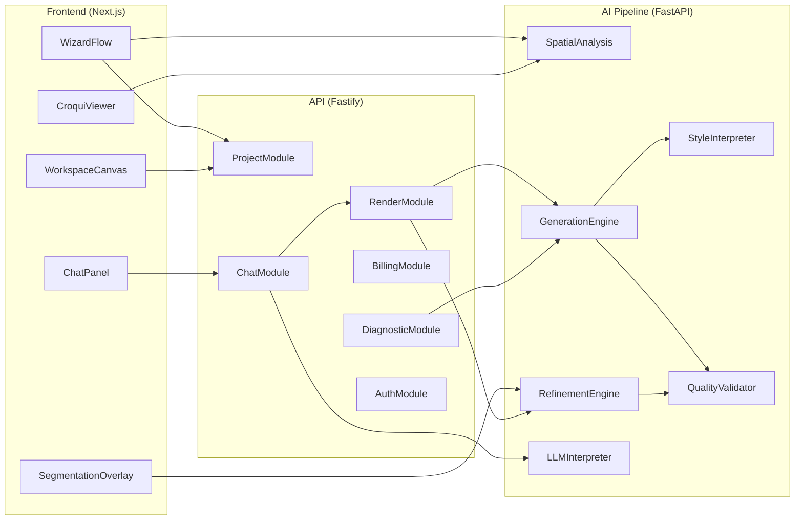

# DecorAI Brasil — Components

> **Parent document:** [fullstack-architecture.md](../fullstack-architecture.md) | [Index](./index.md)
> **Section:** 6

---

## 6. Components

### 6.1 Frontend Components

#### WorkspaceCanvas
**Responsibility:** Renderizar imagem gerada com zoom/pan, slider antes/depois, e overlays de segmentacao.
**Key Interfaces:** Canvas rendering, image loading, zoom controls, slider interaction
**Dependencies:** ProjectVersion data, Zustand canvas store, Framer Motion
**Technology:** React + Canvas API + Framer Motion
**DecorAI Agent:** staging-architect (output), visual-quality-engineer (quality display)
**Ref:** FR-01, FR-03, FR-10, FR-20

#### ChatPanel
**Responsibility:** Interface de chat para refinamento iterativo com historico de versoes.
**Key Interfaces:** Message send, version navigation, typing indicator, operation preview
**Dependencies:** React Query (server state), WebSocket (real-time), Zustand (UI state)
**Technology:** React + Supabase Realtime
**DecorAI Agent:** conversational-designer (NLU), staging-architect (re-render)
**Ref:** FR-04, FR-05, FR-06, FR-27, FR-28

#### WizardFlow
**Responsibility:** Fluxo de 5 steps para criacao de novo projeto (input → estilo → croqui → geracao).
**Key Interfaces:** Step navigation, file upload, style selection, croqui review, progress display
**Dependencies:** React Hook Form, Zustand wizard store, upload service
**Technology:** React + React Hook Form + Zod validation
**DecorAI Agent:** spatial-analyst (croqui), interior-strategist (estilos)
**Ref:** FR-01, FR-02, FR-24-FR-26, FR-29-FR-32

#### CroquiViewer
**Responsibility:** Exibir e iterar sobre croqui ASCII do ambiente com descricao acessivel.
**Key Interfaces:** ASCII display, adjustment input, approval action, accessibility description
**Dependencies:** Monospace rendering, spatial data, accessibility layer
**Technology:** React + JetBrains Mono font
**DecorAI Agent:** spatial-analyst
**Ref:** FR-29, FR-30, FR-31, FR-32

#### SegmentationOverlay
**Responsibility:** Overlay de segmentacao SAM sobre a imagem com selecao de elementos e troca de material.
**Key Interfaces:** Segment hover/select, material palette, apply action
**Dependencies:** Canvas overlay, SAM masks data, material catalog
**Technology:** React + Canvas API
**DecorAI Agent:** staging-architect
**Ref:** FR-07

### 6.2 Backend Components

#### AuthModule
**Responsibility:** Gerenciamento de autenticacao via Supabase Auth com Google OAuth e email/password.
**Key Interfaces:** Sign up, sign in, token validation, session management, LGPD consent
**Dependencies:** Supabase Auth SDK, JWT validation
**Technology:** Fastify + @supabase/supabase-js
**DecorAI Agent:** proptech-growth (consent flows)
**Ref:** FR-14, NFR-08, NFR-09

#### ProjectModule
**Responsibility:** CRUD de projetos, versoes, historico e favoritos.
**Key Interfaces:** Create, read, update, list, version management
**Dependencies:** Supabase PostgreSQL, Storage (uploads)
**Technology:** Fastify + Supabase client + Zod
**Ref:** FR-15, FR-27

#### RenderModule
**Responsibility:** Enfileirar e gerenciar jobs de render na pipeline GPU.
**Key Interfaces:** Queue job, check status, handle completion, broadcast progress
**Dependencies:** BullMQ (Redis), AI Pipeline (HTTP), Supabase Realtime
**Technology:** Fastify + BullMQ + Supabase Realtime
**DecorAI Agent:** pipeline-optimizer (routing), staging-architect (pipeline steps)
**Ref:** FR-01, FR-19, NFR-01, NFR-06

#### ChatModule
**Responsibility:** Processar mensagens de chat via Claude API e mapear para operacoes de render.
**Key Interfaces:** Process message, extract operations, dispatch render job, save history
**Dependencies:** Claude API, RenderModule, ProjectModule
**Technology:** Fastify + Anthropic SDK
**DecorAI Agent:** conversational-designer
**Ref:** FR-04, FR-05, FR-06, FR-28

#### BillingModule
**Responsibility:** Gerenciar tiers, checkout, webhooks de pagamento e controle de uso.
**Key Interfaces:** Create checkout session, handle webhooks, check render quota, apply watermark
**Dependencies:** Stripe SDK, Asaas SDK, SubscriptionService
**Technology:** Fastify + Stripe + Asaas
**DecorAI Agent:** proptech-growth
**Ref:** FR-16, FR-17, FR-18

#### DiagnosticModule
**Responsibility:** Pipeline de reverse staging — analise de foto e geracao de preview.
**Key Interfaces:** Upload, analyze, generate preview, return diagnosis
**Dependencies:** AI Pipeline (analysis), Storage (images)
**Technology:** Fastify + AI Pipeline HTTP
**DecorAI Agent:** proptech-growth
**Ref:** FR-12, FR-13

### 6.3 AI Pipeline Components

#### SpatialAnalysisService
**Responsibility:** Interpretacao espacial — depth estimation, extracao de dimensoes, geracao de croqui ASCII.
**Key Interfaces:** Analyze photo, parse dimensions, generate croqui, validate space
**Dependencies:** ZoeDepth, Depth Anything V2, Claude Vision API
**Technology:** Python + FastAPI + torch
**DecorAI Agent:** spatial-analyst
**Ref:** FR-22, FR-24-FR-26, FR-29-FR-32

#### GenerationEngine
**Responsibility:** Pipeline de geracao de imagens — conditioning, SDXL, upscale.
**Key Interfaces:** Generate render, restyle, partial re-generation
**Dependencies:** SDXL, ControlNet, Real-ESRGAN, fal.ai/Replicate
**Technology:** Python + FastAPI + diffusers
**DecorAI Agent:** staging-architect
**Ref:** FR-01, FR-03, FR-20, FR-21

#### RefinementEngine
**Responsibility:** Operacoes de edicao parcial — segmentacao, inpainting, iluminacao.
**Key Interfaces:** Segment element, inpaint removal, re-texture, enhance lighting
**Dependencies:** SAM 2, LaMa, IC-Light, ControlNet
**Technology:** Python + FastAPI + torch
**DecorAI Agent:** staging-architect
**Ref:** FR-05, FR-07, FR-08, FR-09

#### StyleInterpreter
**Responsibility:** Sistema de estilos — CLIP matching, IP-Adapter, prompt generation.
**Key Interfaces:** Match style, generate prompt, extract style from reference
**Dependencies:** CLIP, IP-Adapter, brazilian-styles knowledge base
**Technology:** Python + transformers
**DecorAI Agent:** interior-strategist
**Ref:** FR-02, FR-23

#### QualityValidator
**Responsibility:** Validacao de qualidade antes da entrega — FID, SSIM, LPIPS, CLIP Score.
**Key Interfaces:** Validate render quality, benchmark, auto-reject if below threshold
**Dependencies:** torchmetrics, CLIP
**Technology:** Python + torchmetrics
**DecorAI Agent:** visual-quality-engineer
**Ref:** FR-20, NFR-15

#### LLMInterpreter
**Responsibility:** Interpretacao de comandos em PT-BR via Claude API com mapeamento para operacoes.
**Key Interfaces:** Interpret command, extract operations, validate against user specs
**Dependencies:** Claude API (Anthropic), operation schema
**Technology:** Python + anthropic SDK
**DecorAI Agent:** conversational-designer
**Ref:** FR-04, FR-06, FR-28

### 6.4 Component Dependency Diagram

