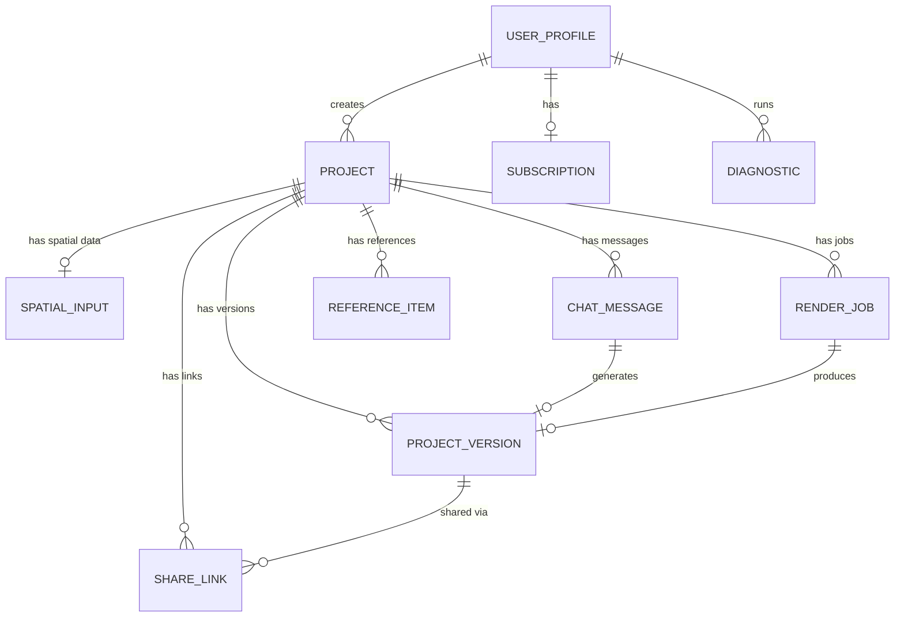

# DecorAI Brasil — Data Models

> **Parent document:** [fullstack-architecture.md](../fullstack-architecture.md) | [Index](./index.md)
> **Section:** 4

---

## 4. Data Models

### 4.1 User (gerenciado por Supabase Auth)

**Purpose:** Identidade do usuario, gerenciado pelo Supabase Auth. Dados adicionais em `user_profiles`.

```typescript
// packages/shared/src/types/user.ts

interface UserProfile {
  id: string;                    // UUID — FK auth.users
  display_name: string;
  avatar_url: string | null;
  preferred_style: DecorStyle | null;
  lgpd_consent_at: string | null;    // ISO 8601
  training_opt_in: boolean;          // NFR-09
  created_at: string;
  updated_at: string;
}
```

**Relationships:**
- Has many `Project`
- Has one `Subscription`
- Has many `Diagnostic`

**Ref:** FR-14, FR-15, NFR-08, NFR-09

### 4.2 Project

**Purpose:** Projeto de decoracao do usuario, com tipo de input, estilo escolhido e status.

```typescript
// packages/shared/src/types/project.ts

type InputType = 'photo' | 'text' | 'combined';
type ProjectStatus = 'draft' | 'analyzing' | 'croqui_review' | 'generating' | 'ready' | 'error';
type DecorStyle = 'moderno' | 'industrial' | 'minimalista' | 'classico' | 'escandinavo' | 'rustico' | 'tropical' | 'contemporaneo' | 'boho' | 'luxo';

interface Project {
  id: string;                    // UUID PK
  user_id: string;               // UUID FK auth.users
  name: string;
  input_type: InputType;
  style: DecorStyle;
  status: ProjectStatus;
  is_favorite: boolean;
  original_image_url: string | null;
  room_type: string | null;      // sala, quarto, cozinha, banheiro, escritorio
  created_at: string;
  updated_at: string;
}
```

**Relationships:**
- Belongs to `UserProfile`
- Has many `ProjectVersion`
- Has one `SpatialInput`
- Has many `ChatMessage`
- Has many `RenderJob`
- Has many `ReferenceItem`

**Ref:** FR-01, FR-02, FR-03, FR-15, FR-24, FR-26

### 4.3 ProjectVersion

**Purpose:** Historico de versoes de render com imagens, prompts e metadados.

```typescript
// packages/shared/src/types/project-version.ts

interface ProjectVersion {
  id: string;                    // UUID PK
  project_id: string;            // UUID FK projects
  version_number: number;
  image_url: string;
  thumbnail_url: string;
  prompt: string;                // Prompt usado para geracao
  refinement_command: string | null; // Comando do chat que gerou esta versao
  quality_scores: QualityScores | null;
  metadata: VersionMetadata;
  created_at: string;
}

interface QualityScores {
  fid: number | null;
  ssim: number | null;
  lpips: number | null;
  clip_score: number | null;
}

interface VersionMetadata {
  depth_map_url: string | null;
  conditioning_params: Record<string, unknown>;
  gpu_provider: string;
  generation_time_ms: number;
  cost_cents: number;
  resolution: { width: number; height: number };
}
```

**Relationships:**
- Belongs to `Project`
- Has many `ChatMessage` (versao gerada por mensagem)

**Ref:** FR-03, FR-20, FR-27

### 4.4 SpatialInput

**Purpose:** Dados espaciais do projeto — medidas, aberturas, itens posicionados e croqui ASCII.

```typescript
// packages/shared/src/types/spatial-input.ts

interface SpatialInput {
  id: string;                    // UUID PK
  project_id: string;            // UUID FK projects
  dimensions: RoomDimensions | null;
  openings: Opening[];
  items: PositionedItem[];
  croqui_ascii: string | null;
  croqui_approved: boolean;
  photo_interpretation: PhotoInterpretation | null;
  created_at: string;
  updated_at: string;
}

interface RoomDimensions {
  width_m: number;
  length_m: number;
  height_m: number;
}

interface Opening {
  type: 'door' | 'window' | 'archway';
  wall: 'north' | 'south' | 'east' | 'west';
  width_m: number;
  height_m: number;
  offset_m: number;              // Distancia da parede esquerda
}

interface PositionedItem {
  name: string;
  width_m: number;
  depth_m: number;
  height_m: number | null;
  position: { x_m: number; y_m: number };
  reference_image_url: string | null;
  material: string | null;
}

interface PhotoInterpretation {
  estimated_dimensions: RoomDimensions;
  detected_openings: Opening[];
  detected_elements: string[];   // pilares, vigas, etc.
  confidence: number;            // 0-1
}
```

**Relationships:**
- Belongs to `Project`

**Ref:** FR-24, FR-25, FR-26, FR-29, FR-30, FR-31, FR-32

### 4.5 ReferenceItem

**Purpose:** Fotos de referencia de itens especificos fornecidas pelo usuario.

```typescript
// packages/shared/src/types/reference-item.ts

interface ReferenceItem {
  id: string;                    // UUID PK
  project_id: string;            // UUID FK projects
  name: string;                  // "sofa", "bancada", etc.
  image_url: string;
  dimensions: {
    width_m: number | null;
    depth_m: number | null;
    height_m: number | null;
  };
  material: string | null;
  color: string | null;
  position_description: string | null;
  created_at: string;
}
```

**Relationships:**
- Belongs to `Project`

**Ref:** FR-25, FR-26

### 4.6 ChatMessage

**Purpose:** Mensagens do chat de refinamento com operacoes extraidas pelo LLM.

```typescript
// packages/shared/src/types/chat-message.ts

type ChatRole = 'user' | 'assistant' | 'system';

interface ChatMessage {
  id: string;                    // UUID PK
  project_id: string;            // UUID FK projects
  role: ChatRole;
  content: string;
  operations: RefinementOperation[] | null; // Operacoes extraidas pelo LLM
  version_id: string | null;     // UUID FK project_versions — versao gerada por esta msg
  created_at: string;
}

interface RefinementOperation {
  type: 'add' | 'remove' | 'change' | 'move' | 'resize';
  target: string;                // "tapete", "piso", "sofa", etc.
  params: Record<string, unknown>;
}
```

**Relationships:**
- Belongs to `Project`
- References `ProjectVersion`

**Ref:** FR-04, FR-05, FR-06, FR-27, FR-28

### 4.7 Subscription

**Purpose:** Assinatura e billing do usuario com tiers e contagem de renders.

```typescript
// packages/shared/src/types/subscription.ts

type SubscriptionTier = 'free' | 'pro' | 'business';
type SubscriptionStatus = 'active' | 'canceled' | 'past_due' | 'trialing';
type PaymentGateway = 'stripe' | 'asaas';

interface Subscription {
  id: string;                    // UUID PK
  user_id: string;               // UUID FK auth.users
  tier: SubscriptionTier;
  status: SubscriptionStatus;
  payment_gateway: PaymentGateway;
  gateway_customer_id: string;
  gateway_subscription_id: string | null;
  renders_used: number;
  renders_limit: number;         // Free: 3, Pro: 100, Business: 500
  current_period_start: string;
  current_period_end: string;
  created_at: string;
  updated_at: string;
}
```

**Relationships:**
- Belongs to `UserProfile`

**Ref:** FR-16, FR-17, FR-18

### 4.8 Diagnostic

**Purpose:** Diagnostico de reverse staging para funil freemium.

```typescript
// packages/shared/src/types/diagnostic.ts

interface Diagnostic {
  id: string;                    // UUID PK
  user_id: string | null;        // UUID FK auth.users — pode ser anonimo
  original_image_url: string;
  staged_preview_url: string | null;
  analysis: DiagnosticAnalysis;
  session_token: string | null;  // Cookie para anonimos (7 dias)
  created_at: string;
}

interface DiagnosticAnalysis {
  issues: DiagnosticIssue[];
  estimated_loss_percent: number;
  estimated_loss_brl: number | null;
  overall_score: number;         // 0-100
  recommendations: string[];
}

interface DiagnosticIssue {
  category: 'lighting' | 'staging' | 'composition' | 'quality' | 'clutter';
  severity: 'low' | 'medium' | 'high';
  description: string;
}
```

**Relationships:**
- Optionally belongs to `UserProfile`

**Ref:** FR-12, FR-13

### 4.9 RenderJob

**Purpose:** Job de processamento GPU na fila assincrona.

```typescript
// packages/shared/src/types/render-job.ts

type RenderJobType = 'initial' | 'refinement' | 'style_change' | 'segmentation' | 'diagnostic' | 'upscale';
type RenderJobStatus = 'queued' | 'processing' | 'completed' | 'failed' | 'canceled';

interface RenderJob {
  id: string;                    // UUID PK
  project_id: string;            // UUID FK projects
  version_id: string | null;     // UUID FK project_versions — versao de output
  type: RenderJobType;
  status: RenderJobStatus;
  priority: number;              // 0=free, 1=pro, 2=business
  input_params: Record<string, unknown>;
  output_params: Record<string, unknown> | null;
  gpu_provider: string | null;   // 'fal', 'replicate'
  cost_cents: number | null;
  duration_ms: number | null;
  error_message: string | null;
  attempts: number;
  started_at: string | null;
  completed_at: string | null;
  created_at: string;
}
```

**Relationships:**
- Belongs to `Project`
- References `ProjectVersion`

**Ref:** FR-19, NFR-01, NFR-04, NFR-06

### 4.10 ShareLink

**Purpose:** Link publico para compartilhamento de versoes de render (antes/depois).

```typescript
// packages/shared/src/types/share-link.ts

interface ShareLink {
  id: string;                    // UUID PK
  project_id: string;            // UUID FK projects
  version_id: string;            // UUID FK project_versions
  slug: string;                  // URL slug unico (ex: "abc123")
  is_active: boolean;
  views_count: number;
  expires_at: string | null;     // ISO 8601 — null = sem expiracao
  created_at: string;
}
```

**Relationships:**
- Belongs to `Project`
- References `ProjectVersion`

**Ref:** FR-10, FR-11

### 4.11 Entity Relationship Diagram


