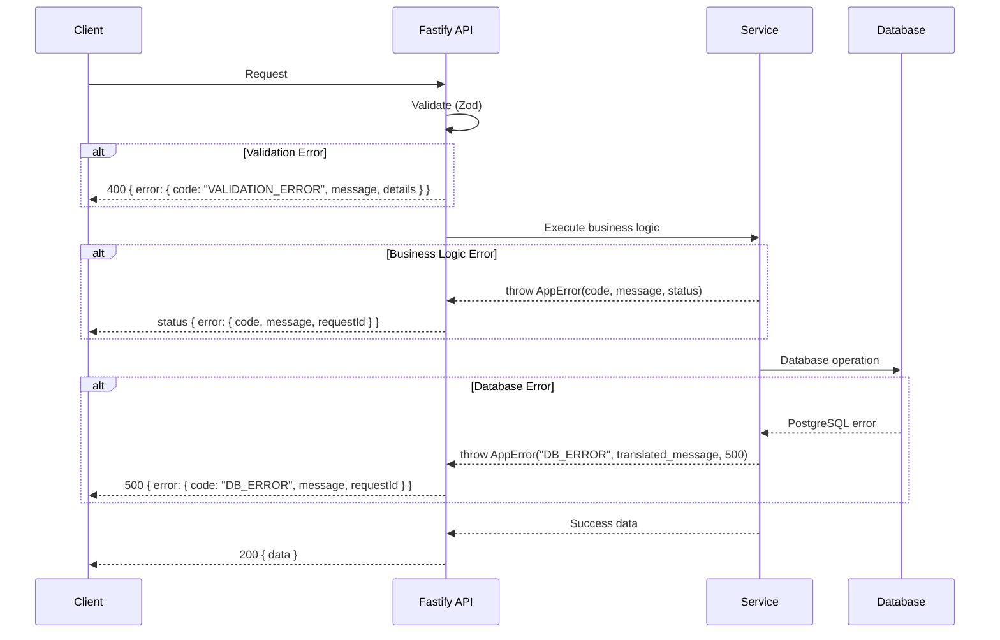

# DecorAI Brasil — Error Handling Strategy

> **Parent document:** [fullstack-architecture.md](../fullstack-architecture.md) | [Index](./index.md)
> **Section:** 18

---

## 18. Error Handling Strategy

### 18.1 Error Flow



### 18.2 Error Response Format

```typescript
// packages/shared/src/types/error.ts
interface ApiErrorResponse {
  error: {
    code: string;           // e.g., "RENDER_QUOTA_EXCEEDED"
    message: string;        // Human-readable, em PT-BR
    details?: Record<string, unknown>;
    timestamp: string;      // ISO 8601
    requestId: string;      // UUID para debug
  };
}
```

### 18.3 Backend Error Handler

```typescript
// middleware/error-handler.ts
import { FastifyError, FastifyReply, FastifyRequest } from 'fastify';
import { randomUUID } from 'crypto';
import { logger } from '../lib/logger';

export class AppError extends Error {
  constructor(
    public code: string,
    message: string,
    public statusCode: number = 500,
    public details?: Record<string, unknown>
  ) {
    super(message);
  }
}

export function errorHandler(error: FastifyError, request: FastifyRequest, reply: FastifyReply) {
  const requestId = randomUUID();

  if (error instanceof AppError) {
    logger.warn({ code: error.code, requestId, userId: request.user?.id }, error.message);
    return reply.status(error.statusCode).send({
      error: {
        code: error.code,
        message: error.message,
        details: error.details,
        timestamp: new Date().toISOString(),
        requestId,
      },
    });
  }

  // Validation errors (Fastify/Zod)
  if (error.validation) {
    return reply.status(400).send({
      error: {
        code: 'VALIDATION_ERROR',
        message: 'Dados invalidos na requisicao',
        details: error.validation,
        timestamp: new Date().toISOString(),
        requestId,
      },
    });
  }

  // Unexpected errors
  logger.error({ err: error, requestId, userId: request.user?.id }, 'Unexpected error');
  return reply.status(500).send({
    error: {
      code: 'INTERNAL_ERROR',
      message: 'Erro interno do servidor',
      timestamp: new Date().toISOString(),
      requestId,
    },
  });
}
```

### 18.4 Frontend Error Handler

```typescript
// hooks/use-api-error.ts
import { toast } from 'sonner';

const ERROR_MESSAGES: Record<string, string> = {
  RENDER_QUOTA_EXCEEDED: 'Voce atingiu o limite de renders do seu plano. Faca upgrade para continuar.',
  UNAUTHORIZED: 'Sessao expirada. Faca login novamente.',
  PROJECT_NOT_FOUND: 'Projeto nao encontrado.',
  RENDER_FAILED: 'Falha ao gerar imagem. Tente novamente — seu credito foi preservado.',
  VALIDATION_ERROR: 'Dados invalidos. Verifique os campos e tente novamente.',
};

export function handleApiError(error: unknown) {
  if (error instanceof ApiError) {
    const message = ERROR_MESSAGES[error.code] || error.message;
    toast.error(message);

    if (error.code === 'UNAUTHORIZED') {
      window.location.href = '/login';
    }
  } else {
    toast.error('Erro inesperado. Tente novamente.');
  }
}
```
