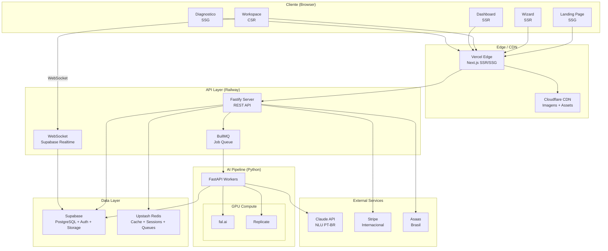

# DecorAI Brasil — High Level Architecture

> **Parent document:** [fullstack-architecture.md](../fullstack-architecture.md) | [Index](./index.md)
> **Sections:** 1-2

---

## 1. Introduction

Este documento define a arquitetura fullstack completa do DecorAI Brasil, cobrindo backend, frontend, pipeline de IA e integracao entre todos os componentes. Serve como fonte unica de verdade para desenvolvimento orientado por IA, garantindo consistencia em toda a stack tecnologica.

A abordagem unificada combina o que tradicionalmente seriam documentos separados de backend e frontend, otimizando o processo de desenvolvimento para uma aplicacao fullstack moderna onde essas preocupacoes sao intrinsecamente interligadas.

### 1.1 Starter Template

**N/A — Projeto greenfield.** O monorepo sera inicializado com Turborepo (`create-turbo`) como base, configurado com packages customizados conforme definido em CON-07.

### 1.2 Change Log

| Date | Version | Description | Author |
|------|---------|-------------|--------|
| 2026-03-09 | 1.0 | Draft inicial — arquitetura fullstack completa | Aria (@architect) |

---

## 2. High Level Architecture

### 2.1 Technical Summary

DecorAI Brasil adota um **Monolito Modular** em monorepo Turborepo com 4 packages (web, api, ai-pipeline, shared), combinando Next.js 14 com App Router para SSR/SSG/CSR seletivo no frontend, Node.js com Fastify para API REST no backend, e Python com FastAPI para o pipeline de IA com workers GPU. A integracao frontend-backend ocorre via REST + WebSocket (Supabase Realtime) para feedback em tempo real durante geracao de renders. A infraestrutura utiliza servicos gerenciados (Vercel, Railway, Supabase, Upstash Redis, fal.ai/Replicate) para minimizar overhead operacional com equipe enxuta (CON-02). Esta arquitetura atinge os objetivos do PRD ao entregar renders fotorrealistas em <30s (NFR-01), chat iterativo em <15s (NFR-02), conformidade LGPD via RLS (NFR-08), e escalabilidade de 2K a 50K renders/mes (NFR-05).

**Ref:** CON-02, CON-06, CON-07, NFR-01, NFR-05, NFR-12

### 2.2 Platform and Infrastructure Choice

**Platform:** Vercel + Supabase + Managed GPU
**Key Services:** Vercel (frontend), Railway (API Node.js), Supabase (PostgreSQL + Auth + Storage + Realtime), Upstash (Redis), fal.ai/Replicate (GPU compute), Cloudflare (CDN imagens), Stripe + Asaas (payments)
**Deployment Regions:** Sao Paulo (GRU) — latencia minima para publico brasileiro

**Rationale:**
- Vercel + Supabase oferece auth integrado, storage com CDN, RLS nativo e realtime — elimina 3-4 servicos separados (CON-02)
- Managed GPU (fal.ai/Replicate) evita ops de infraestrutura GPU, pay-per-use ideal para MVP lean (CON-06)
- Railway para backend Node.js com deploy automatico e scaling horizontal
- Stack inteiramente serverless-friendly, compativel com escala de 2K→50K renders/mes (NFR-05)

**Ref:** CON-02, CON-06, NFR-05

### 2.3 Repository Structure

**Structure:** Monorepo
**Monorepo Tool:** Turborepo
**Package Organization:** 4 packages com fronteiras claras de dominio

```
decorai/
├── packages/
│   ├── web/          # Next.js 14 (App Router) — frontend
│   ├── api/          # Node.js + Fastify — REST API
│   ├── ai-pipeline/  # Python + FastAPI — GPU workers
│   └── shared/       # TypeScript types, constants, utils
├── turbo.json        # Pipeline de build/test/lint
└── package.json      # Root workspace
```

**Ref:** CON-07

### 2.4 High Level Architecture Diagram



### 2.5 Architectural Patterns

- **Monolito Modular:** Packages independentes com interfaces claras, evoluindo para microservicos quando necessario — _Rationale:_ Equipe enxuta (CON-02) nao justifica overhead de microservicos, mas fronteiras claras permitem escala futura (NFR-05)
- **Component-Based UI (Atomic Design):** Componentes React organizados em atoms, molecules, organisms com shadcn/ui + Radix — _Rationale:_ Reutilizacao, consistencia visual e acessibilidade WCAG AA (NFR-12, UX Spec §5)
- **Repository Pattern:** Abstrai acesso a dados via Supabase client — _Rationale:_ Testabilidade e flexibilidade para migrar banco se necessario
- **CQRS Leve:** Separacao de leitura (React Query) e escrita (mutations) no frontend — _Rationale:_ Otimiza cache e UX de feedback imediato
- **Event-Driven (GPU Pipeline):** BullMQ + WebSocket para processamento assincrono com feedback real-time — _Rationale:_ Renders levam 10-30s, usuario precisa de feedback (FR-19, NFR-16)
- **BFF (Backend for Frontend):** API Node.js atua como intermediario entre frontend e AI Pipeline Python — _Rationale:_ Isola complexidade ML, permite evolucao independente
