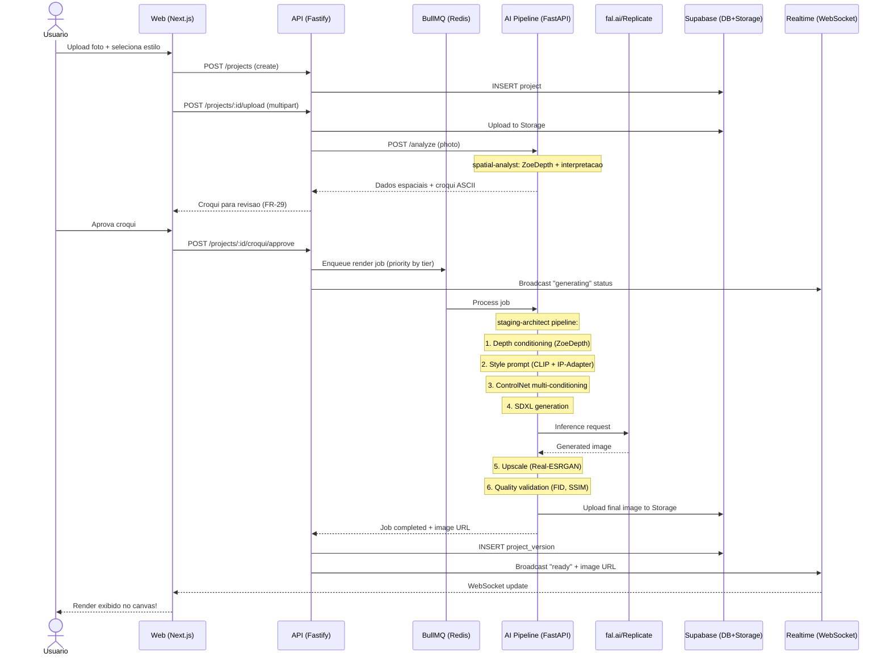
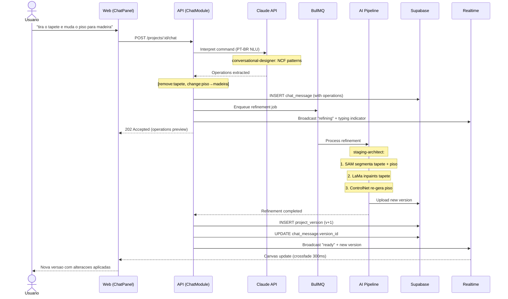
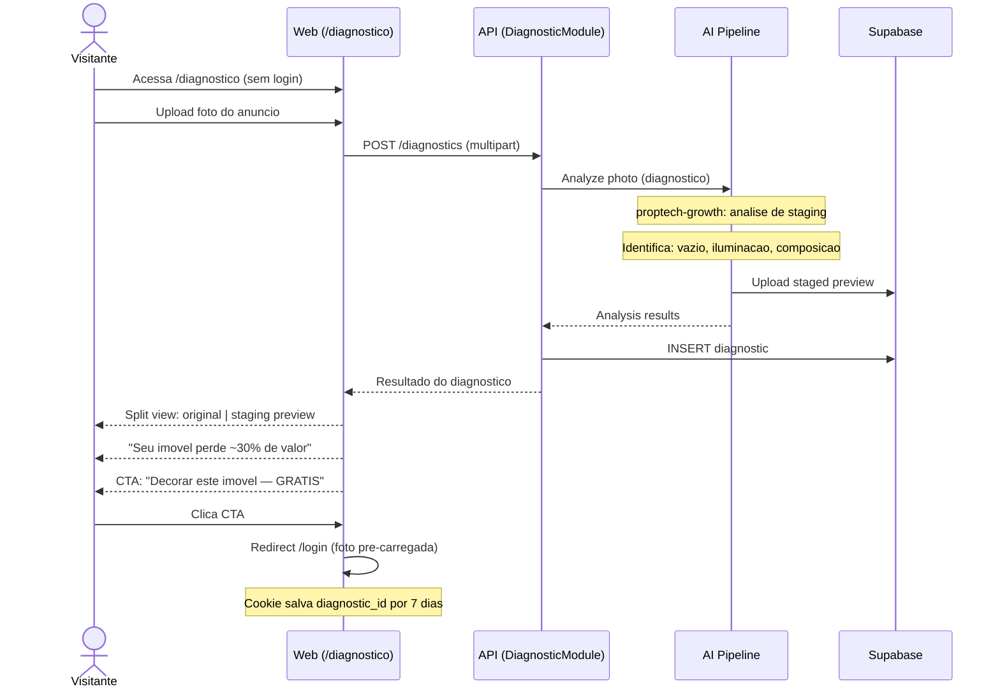
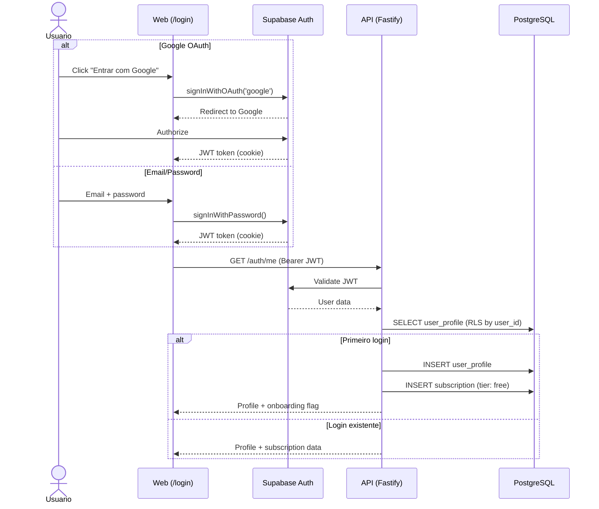

# DecorAI Brasil — Core Workflows

> **Parent document:** [fullstack-architecture.md](../fullstack-architecture.md) | [Index](./index.md)
> **Section:** 8

---

## 8. Core Workflows

### 8.1 Workflow 1 — Geracao de Render (Time-to-Value < 3 min)

**Ref:** FR-01, FR-02, FR-21, FR-22, FR-29, FR-31, NFR-01, NFR-03, NFR-16

### 8.2 Workflow 2 — Chat de Refinamento

**Ref:** FR-04, FR-05, FR-06, FR-27, FR-28, NFR-02

### 8.3 Workflow 3 — Reverse Staging (Funil Freemium)

**Ref:** FR-12, FR-13

### 8.4 Workflow 4 — Autenticacao

**Ref:** FR-14, NFR-08
