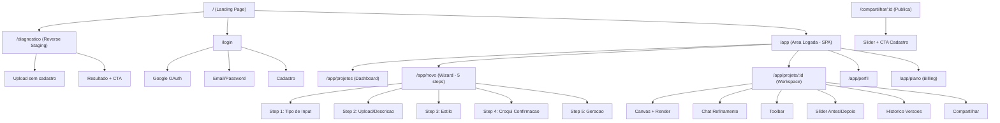

# DecorAI Brasil — Front-End Specification

**Versao:** 1.0
**Data:** 2026-03-08
**Autora:** Uma (@ux-design-expert)
**Status:** Draft
**Baseado em:** [PRD v1.2](prd.md), [Project Brief v1.0](project-brief.md), [UX/UI Spec v1.0](architecture/ux-ui-spec.md)

---

## 1. Introduction

Este documento define os objetivos de experiencia do usuario, arquitetura de informacao, fluxos de usuario e especificacoes de design visual para a interface do DecorAI Brasil. Serve como base para design visual e desenvolvimento frontend, garantindo uma experiencia coesa e centrada no usuario.

### 1.1 Target User Personas

**Persona 1 — Carlos, Corretor de Imoveis (Primario)**
- 38 anos, habilidade tecnica baixa-moderada
- Dispositivo: celular (Samsung Galaxy) + notebook basico
- Cenario: fotografa imovel vazio, precisa de imagem decorada em minutos para publicar no ZAP/OLX
- Necessidade: rapidez, simplicidade, resultado pronto para WhatsApp
- **Ref:** PRD §1.3 (Primario), Brief §Target Users

**Persona 2 — Marina, Arquiteta (Terciario)**
- 32 anos, alta habilidade tecnica (SketchUp, AutoCAD, Figma)
- Dispositivo: MacBook Pro + monitor externo
- Cenario: tem medidas e fotos de referencia, quer gerar visualizacao para cliente
- Necessidade: inputs multiplos, refinamento fino, qualidade profissional
- **Ref:** PRD §1.3 (Terciario), FR-24, FR-25, FR-26

**Persona 3 — Roberto, Gerente de Marketing (Secundario)**
- 45 anos, habilidade moderada
- Dispositivo: desktop corporativo
- Cenario: staging de 5 tipologias com variacao de estilos e alta resolucao
- Necessidade: troca rapida de estilos, volume, material impresso
- **Ref:** PRD §1.3 (Secundario), FR-03

### 1.2 Usability Goals

1. **Time-to-value < 3 min** — Do cadastro ao primeiro render (NFR-03)
2. **Eficiencia de uso** — Troca de estilo com 1 clique, chat em linguagem natural (FR-03, FR-04)
3. **Prevencao de erros** — Croqui de confirmacao antes da geracao (FR-29, FR-31)
4. **Memorabilidade** — Interface minimalista, navegacao com max 3 itens

### 1.3 Design Principles

1. **Simplicidade primeiro** — O corretor Carlos precisa decorar em 3 minutos, nao aprender uma ferramenta
2. **Feedback imediato e honesto** — Toda acao tem resposta visual. Quando o resultado nao agrada, o sistema guia para melhoria (chat, regenerar, trocar estilo) — nunca deixa o usuario sem saida
3. **Discoverability progressiva** — Funcoes avancadas (segmentacao, medidas) sao acessiveis mas nao obrigatorias
4. **Confianca visual com rede de seguranca** — Slider antes/depois como prova de valor + croqui de confirmacao como prevencao + chat como correcao. Se falhar, custo baixo (credito preservado, regeneracao facil)
5. **Acessivel por padrao, inclusivo por design** — WCAG AA + representacoes alternativas para conteudo visual (descricao textual do croqui, alt-text rico para renders)
6. **Escalavel para profissionais** — Templates salvos, historico reutilizavel, batch de estilos. O Carlos usa 1x, o Roberto usa 20x — ambos devem ser produtivos

### 1.4 Change Log

| Date | Version | Description | Author |
|------|---------|-------------|--------|
| 2026-03-08 | 1.0 | Draft inicial — todas as secoes | Uma (@ux-design-expert) |

---

## 2. Information Architecture

### 2.1 Site Map / Screen Inventory



### 2.2 Navigation Structure

**Navegacao Publica:**
- Header: Logo | Como Funciona | Estilos | Precos | [Login]
- CTA duplo no hero: "Comece Gratis" + "Diagnostico Gratuito"
- Footer: Termos, Privacidade, LGPD, Contato

**Navegacao Logada:**
- Header compacto: Logo | Projetos | [+ Novo Projeto] | [Badge Tier] [Avatar dropdown]
- Max 3 itens no menu — decisao deliberada para simplicidade (P1)
- Avatar dropdown: Perfil, Plano, Sair

**Breadcrumb Strategy:**
- Nao utilizado na area logada (profundidade maxima = 2 niveis)
- Wizard usa stepper horizontal (Step 1-5) em vez de breadcrumb
- Workspace: titulo do projeto no header como contexto

---

## 3. User Flows

### 3.1 Flow 1 — Primeiro Render (Time-to-Value < 3 min)

**User Goal:** Decorar seu primeiro ambiente o mais rapido possivel
**Entry Points:** Landing CTA, Google search, indicacao WhatsApp
**Success Criteria:** Render completo exibido no workspace em < 3 min

```
Landing Page → [CTA "Comece Gratis"] → [Cadastro Rapido]
    → Google OAuth (1 clique) OU email/password
    → [Onboarding Guiado] "Envie sua primeira foto"
    → [Wizard Step 1] Seleciona "Foto do Local"
    → [Wizard Step 2] Upload foto + Tipo de ambiente
    → [Wizard Step 3] Seleciona estilo (grid visual)
    → [Wizard Step 4] Croqui ASCII de confirmacao → [Aprovar] / [Ajustar]
    → [Wizard Step 5] Geracao (progress bar + WebSocket, 10-30s)
    → [Workspace] Render pronto! Canvas + Chat + Slider
```

**Edge Cases:**
- Foto escura/borrada → IA sugere melhoria de iluminacao (FR-08) antes de gerar
- Foto nao e de ambiente → "Nao reconhecemos um ambiente nesta foto"
- Upload > 20MB → Mensagem com limite + oferta de compressao automatica
- Croqui impreciso → Iteracao ilimitada (FR-30)
- Geracao timeout (> 45s) → "Esta demorando mais que o normal" + notificacao quando pronto
- Falha de geracao → Credito preservado + [Tentar Novamente]

**Ref:** FR-01, FR-02, FR-29, FR-31, FR-32, NFR-01, NFR-03

### 3.2 Flow 2 — Refinamento via Chat

**User Goal:** Ajustar o resultado ate ficar satisfeito
**Entry Points:** Workspace apos geracao, retorno a projeto existente
**Success Criteria:** Versao final atende expectativa do usuario

```
[Workspace] → [Chat Panel] → Usuario digita: "tira o tapete"
    → [IA processa] (< 15s, typing indicator)
    → [Canvas atualiza] (fade-in nova versao)
    → Slider atualiza + Historico v(n+1)
    → [Opcoes] Continuar refinando | Voltar versao | Trocar estilo | Compartilhar | Download
```

**Edge Cases:**
- Comando ambiguo → IA pede clarificacao
- Comando contradiz spec do usuario (FR-28) → IA alerta antes de executar
- Muitas versoes (> 20) → Historico com scroll + busca
- Chat lento (> 15s) → "Processando alteracao mais complexa..." + tempo estimado

**Ref:** FR-04, FR-05, FR-06, FR-27, FR-28, NFR-02

### 3.3 Flow 3 — Input Multi-Formato (Arquiteto)

**User Goal:** Render a partir de medidas + fotos de referencia
**Entry Points:** Wizard Step 1 > "Combinado"
**Success Criteria:** Render respeita rigorosamente medidas e referencias

```
[Wizard Step 1] Seleciona "Combinado"
    → [Step 2] Upload foto (opcional) + Formulario de medidas + Itens especificos
    → [Step 3] Seleciona estilo
    → [Step 4] Croqui ASCII detalhado (itens posicionados com medidas)
    → [Step 5] Geracao (20-30s)
    → [Workspace] Render com itens especificados + Chat para refinamento
```

**Edge Cases:**
- Medidas inconsistentes → Alerta no croqui: "O sofa excede a largura da sala"
- Foto de referencia irreconhecivel → "Descreva o item em texto"
- Foto + medidas conflitantes → Croqui mostra ambos, pergunta prioridade

**Ref:** FR-24, FR-25, FR-26, FR-29, FR-30, FR-31, FR-32

### 3.4 Flow 4 — Reverse Staging (Funil Freemium)

**User Goal:** Descobrir valor perdido sem staging
**Entry Points:** Landing CTA, ad campaign, SEO
**Success Criteria:** Conversao para cadastro apos diagnostico

```
[Landing] → [CTA "Descubra quanto esta perdendo"]
    → [/diagnostico] Upload (sem cadastro)
    → [IA Analisa] (loading com dicas)
    → [Resultado] Split foto original | staging preview + Diagnostico + Impacto
    → [CTA] "Decorar este imovel agora — GRATIS"
    → [Cadastro] Foto pre-carregada → Wizard Step 3
```

**Edge Cases:**
- Foto ja com staging → "Seu anuncio ja tem boa apresentacao! Experimente outros estilos?"
- Foto de exterior → "Diagnostico funciona melhor com ambientes internos"
- Retorno sem cadastro → Cookie salva resultado 7 dias

**Ref:** FR-12, FR-13

### 3.5 Flow 5 — Edicao de Elementos (Segmentacao)

**User Goal:** Trocar um elemento especifico sem afetar o resto
**Entry Points:** Toolbar > "Segmentar"

```
[Workspace] → [Toolbar: Segmentar] → [SAM segmenta imagem]
    → [Hover: contorno sutil] → [Click: elemento selecionado, resto 70% opacidade]
    → [Painel de Opcoes] Material + Cor/Textura → [Aplicar]
    → [Render parcial] Apenas elemento muda → Nova versao no historico
```

**Edge Cases:**
- Segmentacao imprecisa → "Use o chat: 'mude o piso para madeira'"
- Elemento muito pequeno → Zoom automatico na area

**Ref:** FR-07

### 3.6 Flow 6 — Compartilhamento

**User Goal:** Enviar resultado para cliente via WhatsApp
**Entry Points:** Toolbar > "Compartilhar"

```
[Workspace] → [Toolbar: Compartilhar] → [Modal]
    → Preview slider + Link + [Copiar] + [WhatsApp] [Instagram] [Email]
    → Marca d'agua: [On/Off] (obrigatorio Free)
    → [/compartilhar/:id] Pagina publica: slider + disclaimer IA + CTA cadastro
```

**Edge Cases:**
- Link expirado → "Este projeto nao esta mais disponivel. Crie o seu!"
- Plano Free → Toggle marca d'agua desabilitado + CTA upgrade

**Ref:** FR-10, FR-11, FR-17

---

## 4. Wireframes & Mockups

**Primary Design Files:** Wireframes ASCII em [UX/UI Spec §4](architecture/ux-ui-spec.md). Design visual de alta fidelidade a ser criado em Figma (pendente).

### 4.1 Landing Page (`/`)

**Purpose:** Converter visitantes em usuarios ou leads via Reverse Staging
**Ref wireframe:** UX Spec §4.1

**Layout Specs:**
```
Max-width: 1200px, centralizado
Hero: grid 2 colunas (1fr 1fr), gap 48px | Mobile: stack vertical
Como funciona: grid 3 colunas, gap 24px | Mobile: 1 coluna
Estilos: grid 5 colunas, gap 16px | Mobile: grid 2 colunas
Pricing: grid 3 colunas, gap 24px | Mobile: 1 coluna, Pro no topo
Section padding: 80px vertical (desktop), 48px (mobile)
```

**Ref:** FR-02, FR-12, FR-13, FR-16, NFR-14, NFR-17

### 4.2 Wizard — Novo Projeto (`/app/novo`)

**Purpose:** Guiar usuario do input ao render em 5 steps lineares
**Ref wireframe:** UX Spec §4.2

**Layout Specs:**
```
Max-width: 800px, centralizado
Stepper: flex horizontal, 64px height
Content area: min-height calc(100vh - header - stepper - footer)
Footer botoes: sticky bottom, padding 24px
Step 2 (Upload): drop zone 400x300px, sidebar itens 320px | Mobile: stack vertical
Step 3 (Estilos): grid 5 colunas, cards 160x120px | Mobile: grid 2 colunas
Step 4 (Croqui): area 600x450px, monospace font | Mobile: scroll both axes, pinch-to-zoom
```

**Interaction Notes:**
- Steps lineares — nao se pode pular (Step 4 depende de 1-3)
- Step 4 iteravel — campo de texto para ajustes + [Ajustar]
- Step 5 auto-avanca para workspace quando completa

**Ref:** FR-01, FR-02, FR-24, FR-25, FR-26, FR-29, FR-30, FR-31, FR-32

### 4.3 Workspace (`/app/projeto/:id`)

**Purpose:** Editor principal — canvas, chat, ferramentas, historico
**Ref wireframe:** UX Spec §4.3

**Layout Specs:**
```
CSS Grid:
  grid-template-columns: 1fr 360px
  grid-template-rows: 48px 1fr auto auto

  Header:  col 1-2, row 1 (48px, compacto)
  Canvas:  col 1,   row 2 (flex grow)
  Toolbar: col 1,   row 3 (56px)
  History: col 1,   row 4 (80px)
  Chat:    col 2,   row 2-4 (full height, scrollable)

Canvas: object-fit contain, background #F9FAFB
Chat: border-left 1px solid var(--color-surface-border)
      Resizable (min 280px, max 480px)
Toolbar: flex horizontal, gap 8px
History: flex horizontal, overflow-x auto, scroll-snap

Mobile (< 768px):
  grid-template-columns: 1fr
  Chat: bottom sheet (drag up), initial height 30vh
  Toolbar: fixed bottom, 56px, icon-only
  History: horizontal scroll below canvas
```

**Ref:** FR-03 a FR-11, FR-17, FR-19, FR-20, FR-27, FR-28

### 4.4 Dashboard (`/app/projetos`)

**Purpose:** Listar projetos com acesso rapido
**Ref wireframe:** UX Spec §4.5

**Layout Specs:**
```
Max-width: 1200px
Cards: grid auto-fill, minmax(280px, 1fr), gap 24px | Mobile: 1 coluna
Card: 280px, thumbnail aspect-ratio 4/3, hover shadow-lg + scale(1.02)
Tier bar: full width, 64px, fixed bottom do content | Mobile: acima dos cards
```

**Ref:** FR-15, FR-16, FR-17

### 4.5 Login/Cadastro (`/login`)

**Purpose:** Autenticacao com minimo de friccao
**Ref wireframe:** UX Spec §4.6

**Layout Specs:**
```
Grid 2 colunas (1fr 1fr)
Esquerda: imagem showcase (object-fit cover, 100vh)
Direita: form centralizado, max-width 400px
Mobile: apenas form (imagem hidden)
```

**Ref:** FR-14, NFR-08

### 4.6 Diagnostico (`/diagnostico`)

**Purpose:** Funil freemium sem cadastro
**Ref wireframe:** UX Spec §4.7

**Layout Specs:**
```
Max-width: 800px, centralizado
Upload zone: 500x300px
Resultado: grid 2 colunas | Mobile: stack vertical
CTA: button primary lg, full width, margin-top 32px
```

**Ref:** FR-12, FR-13

---

## 5. Component Library / Design System

**Approach:** Atomic Design (Brad Frost) + shadcn/ui (Radix primitives) + Tailwind CSS + CSS custom properties para design tokens. Sem CSS-in-JS.

### 5.1 Atoms

| Componente | Variantes | Estados | Ref |
|-----------|-----------|---------|-----|
| **Button** | primary, secondary, ghost, danger, icon | default, hover, active, focus, disabled, loading | — |
| **Input** | text, number, email, password | default, focus, error, disabled | — |
| **Textarea** | — | default, focus, error, disabled | — |
| **FileUpload** | dropzone, camera | empty, dragover, uploading, uploaded, error | FR-01 |
| **Select** | dropdown, visual-grid | default, open, error, disabled | — |
| **Badge** | status, tier, count | — | FR-16 |
| **Avatar** | sm (32px), md (40px) | loaded, fallback | — |
| **Icon** | 16px, 20px, 24px | — | — |
| **SliderControl** | — | dragging, idle | FR-10 |
| **ProgressBar** | linear, circular | indeterminate, determinate | NFR-16 |
| **Tooltip** | — | visible, hidden | — |

Button sizes: `sm` (32px), `md` (40px), `lg` (48px). Touch targets minimo 44x44px mobile.
Icon library: Lucide Icons (MIT, tree-shakable) + 10 custom SVGs para estilos de decoracao.

### 5.2 Molecules

| Componente | Composicao | Ref |
|-----------|-----------|-----|
| **UploadCard** | FileUpload + Icon + Text + Button | FR-01 |
| **ItemReferenceCard** | Thumbnail + Text + Input (medidas) + Buttons | FR-25 |
| **ChatMessage** | Avatar + Text + Timestamp | FR-04 |
| **StyleCard** | Image + Text + Radio | FR-02 |
| **VersionThumbnail** | Image (mini) + Badge + Timestamp | FR-27 |
| **PricingCard** | Badge + Text + List + Button | FR-16 |
| **ProjectCard** | Image + Text + Badge + IconButton | FR-15 |
| **DiagnosticResult** | Image (split) + List + Text + Button | FR-12 |
| **MeasurementInput** | Input (number) + Select (unidade) + Label | FR-24 |
| **OpeningInput** | Select (tipo) + Select (parede) + MeasurementInput x2 | FR-24 |

### 5.3 Organisms

| Componente | Purpose | Ref |
|-----------|---------|-----|
| **HeaderPublic** | Navegacao publica | — |
| **HeaderApp** | Navegacao logada | FR-15, FR-16 |
| **WorkspaceToolbar** | Ferramentas de edicao (7 botoes) | FR-03, FR-07-FR-11 |
| **ChatPanel** | Chat de refinamento + envio + nav versoes | FR-04, FR-27 |
| **VersionHistoryStrip** | Historico horizontal de versoes | FR-27 |
| **WizardStepper** | Indicador de progresso (5 steps) | — |
| **SliderBeforeAfter** | Comparacao antes/depois | FR-10 |
| **ShareModal** | Compartilhamento (preview + links + opcoes) | FR-11, FR-17 |
| **CroquiViewer** | Visualizador croqui ASCII + ajustes | FR-29, FR-30, FR-31 |
| **SegmentationOverlay** | Overlay SAM + painel de materiais | FR-07 |
| **TierStatusBar** | Barra de uso do plano + CTA upgrade | FR-16 |
| **Footer** | Footer publico + disclaimer IA | NFR-17 |
| **CookieBanner** | Consentimento LGPD | NFR-08 |

### 5.4 Component Dependency Tree

```
Pages
├── LandingPage
│   ├── HeaderPublic
│   ├── SliderBeforeAfter (hero)
│   ├── StyleCard[] (galeria)
│   ├── PricingCard[] (pricing)
│   └── Footer
├── WorkspacePage
│   ├── HeaderApp (compacto)
│   ├── Canvas (imagem + zoom/pan)
│   ├── WorkspaceToolbar
│   ├── VersionHistoryStrip
│   ├── ChatPanel
│   ├── SliderBeforeAfter (toggle)
│   ├── SegmentationOverlay (modo)
│   └── ShareModal
├── WizardPage
│   ├── HeaderApp
│   ├── WizardStepper
│   ├── UploadCard (step 2)
│   ├── ItemReferenceCard[] (step 2)
│   ├── MeasurementInput[] (step 2 textual)
│   ├── StyleCard[] (step 3)
│   ├── CroquiViewer (step 4)
│   └── ProgressBar (step 5)
├── DashboardPage
│   ├── HeaderApp
│   ├── ProjectCard[]
│   └── TierStatusBar
└── DiagnosticoPage
    ├── HeaderPublic
    ├── UploadCard
    ├── DiagnosticResult
    └── Footer
```

---

## 6. Branding & Style Guide

### 6.1 Color Palette

| Tipo | Token | Hex | Uso | Contraste |
|------|-------|-----|-----|-----------|
| Primary | `--color-primary-500` | `#6366F1` | CTA, links, selecao | 4.6:1 (AA) |
| Primary hover | `--color-primary-600` | `#4F46E5` | Hover de botoes | 5.4:1 (AA) |
| Primary active | `--color-primary-700` | `#4338CA` | Active/pressed | 6.5:1 (AAA) |
| Primary light | `--color-primary-50` | `#EEF2FF` | Backgrounds sutis | — |
| Secondary | `--color-secondary-500` | `#EC4899` | Acentos, badges Pro | 3.1:1 |
| Success | `--color-success` | `#10B981` | Confirmacoes | 3.0:1 |
| Warning | `--color-warning` | `#F59E0B` | Alertas, tier Business | 2.1:1 * |
| Error | `--color-error` | `#EF4444` | Erros, acoes destrutivas | 3.9:1 |
| Info | `--color-info` | `#3B82F6` | Informacoes | 4.3:1 (AA) |
| Surface bg | `--color-surface-bg` | `#FFFFFF` | Fundo principal | — |
| Surface subtle | `--color-surface-subtle` | `#F9FAFB` | Canvas bg | — |
| Surface muted | `--color-surface-muted` | `#F3F4F6` | Chat IA | — |
| Border | `--color-surface-border` | `#E5E7EB` | Bordas | — |
| Text primary | `--color-surface-dark` | `#111827` | Texto principal | 17.4:1 (AAA) |
| Chat user | `--color-chat-user` | `#6366F1` | Fundo msg usuario | — |
| Chat AI | `--color-chat-ai` | `#F3F4F6` | Fundo msg IA | — |
| Tier Free | `--color-tier-free` | `#9CA3AF` | Badge Free | — |
| Tier Pro | `--color-tier-pro` | `#6366F1` | Badge Pro | — |
| Tier Business | `--color-tier-business` | `#F59E0B` | Badge Business | — |

\* Warning `#F59E0B` falha contraste sobre branco — usar apenas como fundo com texto `#111827`.

### 6.2 Typography

**Font Families:**
- Primary: `'Inter', system-ui, -apple-system, sans-serif`
- Monospace: `'JetBrains Mono', 'Fira Code', monospace` (croquis ASCII)

**Type Scale:**

| Element | Size | Weight | Line Height |
|---------|------|--------|-------------|
| Display | 36px (2.25rem) | 700 | 1.25 |
| H1 | 30px (1.875rem) | 700 | 1.25 |
| H2 | 24px (1.5rem) | 600 | 1.25 |
| H3 | 20px (1.25rem) | 600 | 1.5 |
| Body | 16px (1rem) | 400 | 1.5 |
| Body sm | 14px (0.875rem) | 400 | 1.5 |
| Caption | 12px (0.75rem) | 400 | 1.5 |

### 6.3 Iconography

- **Library:** Lucide Icons (MIT, tree-shakable)
- **Sizes:** 16px (decorativo), 20px (inline), 24px (botoes/toolbar)
- **Custom:** 10 icones SVG tematicos para estilos de decoracao (grid 24x24)
- **Rule:** Sempre `aria-label` quando icon-only. Cor via `currentColor`.

### 6.4 Spacing & Layout

**Base unit:** 4px (0.25rem)

| Token | Value | Uso |
|-------|-------|-----|
| `--space-1` | 4px | Gap icone/texto inline |
| `--space-2` | 8px | Padding badges, gaps compactos |
| `--space-3` | 12px | Padding inputs, gap toolbar |
| `--space-4` | 16px | Padding cards, gap padrao |
| `--space-6` | 24px | Gap grid, margin entre secoes |
| `--space-8` | 32px | Padding de secoes |
| `--space-12` | 48px | Section padding mobile |
| `--space-16` | 64px | Section padding desktop |
| `--space-20` | 80px | Hero padding |

**Border Radius:** 4px (sm/inputs), 8px (md/cards/botoes), 12px (lg/modais), 9999px (full/avatares)

**Shadows:** `shadow-sm` (repouso), `shadow-md` (hover), `shadow-lg` (elevated), `shadow-xl` (modais)

---

## 7. Accessibility Requirements

**Compliance Target:** WCAG 2.1 Level AA (minimo). AAA para contraste de texto principal.

### 7.1 Visual

- Texto normal: contraste minimo 4.5:1 [WCAG 1.4.3]
- Texto grande: contraste minimo 3:1 [WCAG 1.4.3]
- Elementos interativos: contraste minimo 3:1 vs. fundo [WCAG 1.4.11]
- Focus: outline 2px solido primary-500, offset 2px, focus-visible only [WCAG 2.4.7]
- Base font 16px, unidades em `rem`, suporte zoom 200% [WCAG 1.4.4]

### 7.2 Keyboard Navigation

- Todos os elementos interativos focaveis via Tab [WCAG 2.1.1]
- Ordem de foco segue ordem visual [WCAG 2.4.3]
- Slider: Arrow Left/Right [WCAG 2.1.1]
- Chat: Enter enviar, Shift+Enter nova linha
- Modal: Escape fechar, focus trap [WCAG 2.4.3]
- Toolbar: Arrow Left/Right (roving tabindex)

### 7.3 Screen Readers

- Landmarks: `<header>`, `<nav>`, `<main>`, `<section>`, `<footer>` [WCAG 1.3.1]
- Renders: `alt="Ambiente decorado em estilo [estilo], versao [n]"` [WCAG 1.1.1]
- Upload: `aria-label="Area de upload de foto do ambiente"` [WCAG 4.1.2]
- Slider: `role="slider"`, `aria-valuemin/max/now`, `aria-label` [WCAG 4.1.2]
- Chat: `role="log"`, `aria-live="polite"` [WCAG 4.1.3]
- Progress: `role="progressbar"`, `aria-valuenow` [WCAG 4.1.2]
- Toolbar: `role="toolbar"`, `aria-label` [WCAG 4.1.2]
- Croqui ASCII: `aria-label` + descricao textual estruturada alternativa [WCAG 1.1.1]

### 7.4 Forms

- Labels via `for`/`id` [WCAG 1.3.1]
- Erros via `aria-describedby` [WCAG 3.3.1]
- Erros em texto + icone, nunca apenas cor [WCAG 1.4.1]
- `aria-required="true"` + asterisco visual [WCAG 3.3.2]
- Autocomplete: email, name, current-password [WCAG 1.3.5]

### 7.5 Motion

- `prefers-reduced-motion: reduce` desabilita todas as animacoes [WCAG 2.3.3]
- Nenhum conteudo pisca > 3x/segundo [WCAG 2.3.1]
- Progress bar com alternativa textual [WCAG 1.3.3]

### 7.6 Touch & Mobile

- Alvos minimo 44x44px [WCAG 2.5.5]
- Slider drag handle: 48x48px com hit area expandida
- Nenhuma funcionalidade depende de gestos multitouch [WCAG 2.5.1]
- Drag do slider tem alternativa (botoes +/-) [WCAG 2.5.1]

### 7.7 Croqui ASCII — Acessibilidade Especifica

1. Descricao textual estruturada abaixo do croqui visual
2. Tabela de itens com posicoes e medidas como alternativa
3. Campo de ajuste em texto natural (acessivel)
4. `aria-live="polite"` para anunciar mudancas

### 7.8 Testing Strategy

| Ferramenta | Tipo | Frequencia |
|-----------|------|-----------|
| axe-core (jest-axe) | Automatizado | Cada PR |
| Lighthouse Accessibility | CI/CD (>= 90) | Cada deploy |
| NVDA + Chrome | Manual | Cada release |
| VoiceOver + Safari | Manual | Cada release |
| Keyboard-only | Manual | Cada sprint |

---

## 8. Responsiveness Strategy

**Abordagem:** Mobile-first, progressive enhancement.
**Rationale:** Corretores usam celular para fotografar e publicar. Mobile e de primeira classe.

### 8.1 Breakpoints

| Breakpoint | Min Width | Target |
|-----------|-----------|--------|
| Base | 0px | Celulares portrait |
| `sm` | 640px | Celulares landscape |
| `md` | 768px | Tablets |
| `lg` | 1024px | Desktop |
| `xl` | 1280px | Desktop largo |
| `2xl` | 1536px | Ultra-wide |

### 8.2 Adaptacoes por Componente

| Componente | Mobile (< 768px) | Desktop (>= 1024px) |
|-----------|-------------------|---------------------|
| Canvas | Full width, 60vh | Area esquerda ~65% |
| Chat | Bottom sheet (30vh initial) | Painel direito 360px |
| Toolbar | Fixed bottom, icon-only | Horizontal, icon + texto |
| Version History | Horizontal scroll | Strip horizontal |
| Wizard Stepper | "1/5" compacto | Stepper completo |
| Style Grid | 2 colunas | 5 colunas |
| Hero | Stack vertical | Split 50/50 |
| Pricing | Stack, Pro no topo | 3 colunas |
| Project Cards | 1 coluna | Grid 3-4 colunas |
| Nav | Hamburger | Links horizontais |
| Login | Apenas form | Split imagem + form |
| Upload | Full width + camera | Drag & drop amplo |
| Croqui | Scroll + pinch-zoom | Visualizacao completa |

### 8.3 Imagens Responsivas

- `srcset`: 400w (mobile), 800w (tablet), 1200w (desktop)
- Canvas: 1024px (Free), 2048px (Pro/Business)
- Formato: WebP + fallback JPEG (`<picture>`)
- `loading="lazy"` para galeria e dashboard
- Thumbnails: 200px (mobile), 280px (desktop)

---

## 9. Animation & Micro-interactions

### 9.1 Motion Principles

1. **Funcional** — Toda animacao comunica mudanca de estado
2. **Rapida** — 150ms interacoes, 250ms transicoes, 350ms entradas/saidas
3. **Respeitosa** — `prefers-reduced-motion` desabilita tudo
4. **Performatica** — Apenas `transform` e `opacity` (composited properties)

### 9.2 Key Animations

| Animacao | Duracao | Easing | Ref |
|---------|---------|--------|-----|
| Upload dragover (pulse) | 1s loop | ease-in-out | FR-01 |
| Upload success (checkmark) | 300ms | ease-out | FR-01 |
| Upload error (shake) | 400ms | ease-in-out | FR-01 |
| Render progress bar | Continua | linear | NFR-16 |
| Render preview (blur→nitido) | 2-5s | ease-out | FR-19 |
| Render complete (fade+scale) | 350ms | ease-out | FR-01 |
| Chat typing (3 dots) | 1.2s loop | ease-in-out | FR-04 |
| Chat message (slide up) | 250ms | ease-out | FR-04 |
| Canvas update (crossfade) | 300ms | ease-in-out | FR-05 |
| Version add (slide-in) | 250ms | ease-out | FR-27 |
| Style select (scale+border) | 200ms | ease-out | FR-02 |
| Style hover (shadow+lift) | 150ms | ease | FR-02 |
| Segmentation hover (contorno) | 200ms | ease | FR-07 |
| Segmentation select (overlay) | 250ms | ease-in-out | FR-07 |
| Material apply (crossfade) | 350ms | ease-in-out | FR-07 |
| Slider drag | Real-time (rAF) | — | FR-10 |
| Modal open (backdrop+scale) | 250ms | ease-out | FR-11 |
| Modal close | 200ms | ease-in | FR-11 |
| Toast enter | 250ms | ease-out | — |
| Toast exit | 200ms | ease-in | — |
| Bottom sheet (mobile) | 350ms | cubic-bezier(0.32,0.72,0,1) | — |
| Page transition | 200ms | ease-out | — |

---

## 10. Performance Considerations

### 10.1 Performance Goals

| Metrica | Target |
|---------|--------|
| LCP | < 2.5s |
| FID | < 100ms |
| CLS | < 0.1 |
| TTI | < 3.5s |
| Lighthouse Performance | >= 90 |
| Render generation | < 30s (NFR-01) |
| Chat response | < 15s (NFR-02) |
| Animation FPS | 60fps |
| Bundle size (JS initial) | < 200KB gzipped |

### 10.2 Design Strategies

**Image optimization:** WebP + JPEG fallback, lazy loading, LQIP placeholders, CDN (CloudFront/Cloudflare), `srcset`

**Code splitting:** Route-based (Next.js automatic), workspace components lazy-loaded, icon tree-shaking

**Rendering strategy:**
- Landing, Login, Diagnostico: **SSG** (SEO + LCP)
- Dashboard: **SSR** (data fetching)
- Workspace: **CSR** (interatividade complexa)

**Font loading:** `font-display: swap`, preload Inter Regular + SemiBold, self-hosted

**State management:** Canvas local (React state + refs), chat server state (React Query/SWR), session cookie. `memo` em Canvas e ChatPanel.

---

## 11. Next Steps

### 11.1 Immediate Actions

1. Criar visual designs em Figma baseados nos wireframes e tokens
2. Validar paleta de cores e naming com stakeholders
3. Configurar Tailwind CSS com design tokens customizados
4. Instalar e configurar shadcn/ui com Radix primitives
5. Handoff para @architect (Aria) para front-end architecture
6. Handoff para @dev (Dex) para implementacao de componentes

### 11.2 Design Handoff Checklist

- [x] Todos os user flows documentados (6 flows)
- [x] Inventario de componentes completo (Atomic Design: 11 atoms, 10 molecules, 13 organisms)
- [x] Requisitos de acessibilidade definidos (WCAG AA)
- [x] Estrategia responsiva clara com breakpoints (6 breakpoints, 13 componentes mapeados)
- [x] Brand guidelines e design tokens documentados
- [x] Performance goals estabelecidos (Core Web Vitals + Lighthouse >= 90)
- [x] Microinteracoes e animacoes especificadas (21 animacoes)
- [ ] Visual designs em Figma (pendente)
- [ ] Prototipo interativo (pendente)
- [ ] User testing com corretores (pendente)

---

## 12. Traceability Matrix (Front-End Spec ← PRD)

| Req. PRD | Section | Element |
|----------|---------|---------|
| FR-01 | §3.1, §4.2 | Upload, Wizard, Geracao |
| FR-02 | §3.1, §4.2, §5.1 | StyleCard, Wizard Step 3 |
| FR-03 | §3.2, §4.3 | Toolbar dropdown estilo |
| FR-04 | §3.2, §4.3, §5.3 | ChatPanel |
| FR-05 | §3.2, §9.2 | Chat response < 15s |
| FR-06 | §3.2 | Chat PT-BR (LLM) |
| FR-07 | §3.5, §4.3, §5.3 | SegmentationOverlay |
| FR-08 | §3.1 | Melhoria iluminacao (edge case) |
| FR-09 | §4.3 | Toolbar > Remover |
| FR-10 | §3.6, §4.3, §5.3 | SliderBeforeAfter |
| FR-11 | §3.6, §5.3 | ShareModal + /compartilhar/:id |
| FR-12 | §3.4, §4.6 | Diagnostico page |
| FR-13 | §3.4, §4.6 | CTA no diagnostico |
| FR-14 | §4.5 | Login/Cadastro |
| FR-15 | §4.4, §5.3 | Dashboard + HeaderApp |
| FR-16 | §4.1, §5.2, §5.3 | PricingCard + TierStatusBar |
| FR-17 | §3.6, §5.3 | Marca d'agua + disclaimer |
| FR-18 | §2.1 | Billing page |
| FR-19 | §4.2 | Wizard Step 5 (WebSocket) |
| FR-20 | §4.3 | Download HD (toolbar) |
| FR-24 | §3.3, §4.2, §5.2 | Wizard Step 2 textual |
| FR-25 | §3.3, §5.2 | ItemReferenceCard |
| FR-26 | §3.3, §4.2 | Wizard Step 1 combinado |
| FR-27 | §3.2, §4.3, §5.3 | VersionHistoryStrip + ChatPanel |
| FR-28 | §3.2 | Chat respeitando specs |
| FR-29 | §3.1, §4.2, §5.3 | CroquiViewer (Wizard Step 4) |
| FR-30 | §3.1, §4.2 | Croqui iteravel (3 turnos) |
| FR-31 | §4.2 | Botao Aprovar no croqui |
| FR-32 | §3.1, §3.3 | Interpretacao foto → croqui |
| NFR-01 | §4.2, §10.1 | Progress bar < 30s |
| NFR-02 | §3.2, §10.1 | Chat < 15s |
| NFR-03 | §3.1, §10.1 | Time-to-value < 3 min |
| NFR-08 | §4.5, §7.4, §5.3 | LGPD + CookieBanner |
| NFR-09 | §7.4 | Opt-in treinamento |
| NFR-12 | §8 | Responsivo (6 breakpoints) |
| NFR-13 | §8 | Browser support |
| NFR-14 | All | PT-BR |
| NFR-16 | §4.2, §9.2 | WebSocket progress |
| NFR-17 | §5.3 | Disclaimer IA (Footer) |

---

*— Uma (@ux-design-expert), UX/UI Designer & Design System Architect — Synkra AIOS*
